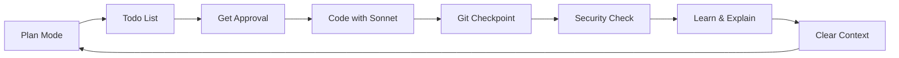

# 🚀 Alex Finn's Claude Code Workflow

> The proven methodology that achieved **zero bugs**, **10x speed**, and built a **$300k/year** AI app.

## 🎯 The 8-Step Workflow

### 1. **ALWAYS Start with Plan Mode** 🏗️
```bash
# Enter plan mode (Shift+Tab twice or)
claude-plan

# Or use the command:
/plan

# Switch to Opus for better planning:
/model opus
```

**Why?** Planning prevents 90% of bugs before they happen.

### 2. **Create Detailed Todo List** 📝
Every plan should create `tasks/todo.md` with:
- [ ] Clear, atomic tasks
- [ ] Ordered by dependency
- [ ] Marked complete as you go

### 3. **Get Plan Approval** ✅
Before coding, always check with user:
- "Here's my plan, shall I proceed?"
- Wait for explicit approval
- Adjust based on feedback

### 4. **Switch to Sonnet for Execution** 💻
```bash
/model sonnet
```
More cost-effective for following plans.

### 5. **Git Checkpoint After EVERY Success** 🎯
```bash
# After each working feature:
claude-checkpoint "Added user authentication"

# If something breaks:
git reset --hard HEAD
```

### 6. **Security Check After Features** 🔒
```
Please check through all the code you just wrote and make sure it follows security best practices. Ensure there are no sensitive information in the front end and no vulnerabilities that can be exploited.
```

### 7. **Learn From The Code** 🎓
```
Please explain the functionality and code you just built in detail. Walk me through what you changed and how it works. Act like you're a senior engineer teaching me code.
```

### 8. **Clear Context Regularly** 🧹
```bash
/clear
```
Use after completing feature groups to prevent hallucinations.

## 💡 Power User Tips

### The Productive Break Chat
While Claude works, open a separate chat:
```
When I am coding with AI there are long breaks. I'd like to use that time to chat with you and generate new ideas instead of doom scrolling. What could be the best way for us to use this chat?
```

### Image-Driven Development
- Screenshot UIs you like
- Paste into Claude: "Build me this UI"
- Screenshot bugs: "Fix this"

### Context Management
- Large context = More errors + Higher cost
- Clear after 3-5 features
- Use git as your checkpoint system

## 📊 Results You Can Expect

Following this exact workflow:
- ✅ **Zero bugs** in months
- ✅ **10x faster** development 
- ✅ **10x higher** code quality
- ✅ **4000%** productivity increase

## 🎬 Quick Command Reference

| Command | Purpose |
|---------|---------|
| `claude-plan` | Enter plan mode |
| `claude-checkpoint` | Save git checkpoint |
| `/model opus` | Switch to Opus (planning) |
| `/model sonnet` | Switch to Sonnet (coding) |
| `/clear` | Clear context |
| `/qa` | Run security check |

## 🔄 The Complete Loop



Remember: **NEVER fire from the hip!** Always plan first.